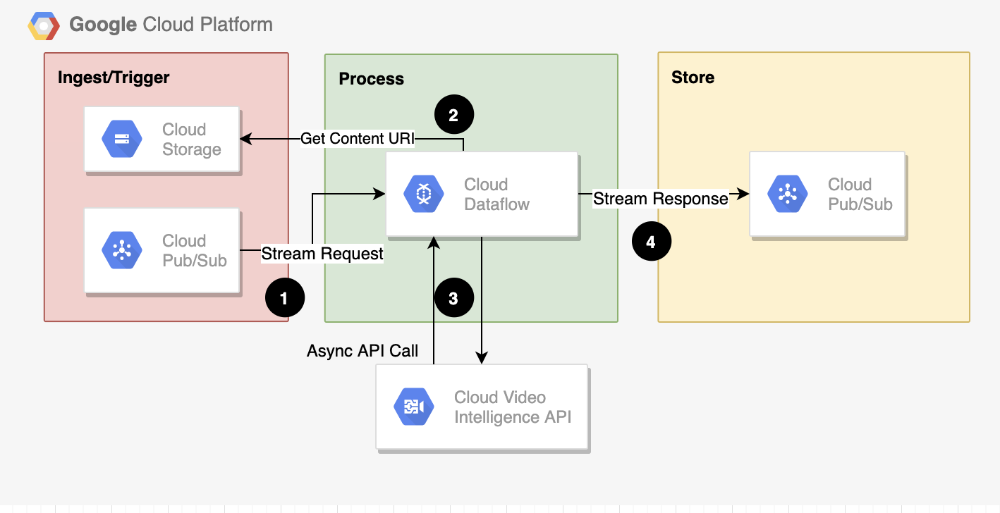
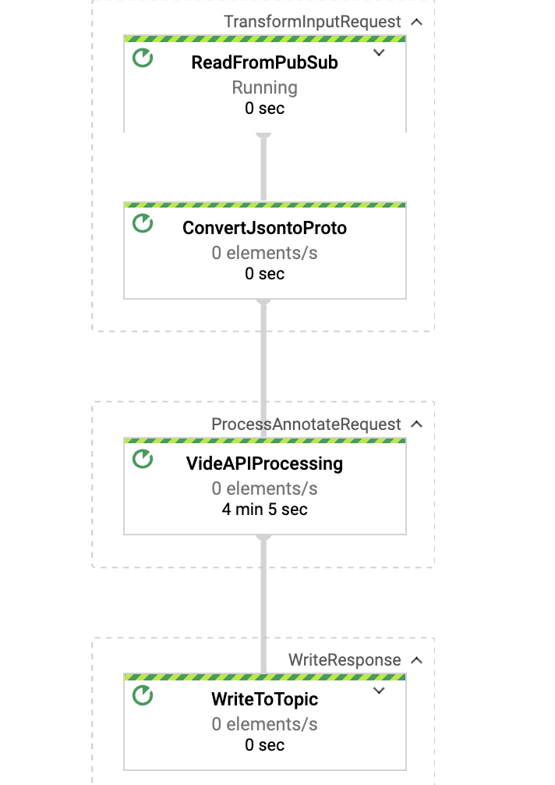

# Video Analytics Solution Using Dataflow & Video AI
This repo contains a reference implementation of a video analytics solution by using Datafow & Video AI.  It's easy to deploy solution and can be used in following use cases:

1.  Analyze video contents stored in GCS for any feature types by  using a pre built ML model as part of Video Intelligent API. 
2. Analyze live streaming video by using Video Intelligence Streaming API 
3. Analyze by using a custom model in Auto ML
 
## Reference Architecture

 
 

## Test 
### Publish a JSON message  with various feature config:
 ```
--> Object Tracking
 gcloud pubsub topics publish ${TOPIC_ID} --message "{\"inputUri\": \"gs://cloud-samples-data/video/cat.mp4\",\"videoContext\":{\"objectTrackingConfig\":  {\"model\":\"builtin/stable\"}},\"features\":[\"OBJECT_TRACKING\"],\"locationId\":\"us-east1\"}"

--> Label Detection
 gcloud pubsub topics publish ${TOPIC_ID} --message "{\"inputUri\": \"gs://cloud-samples-data/video/cat.mp4\",\"videoContext\":{\"labelDetectionConfig\":  {\"model\":\"builtin/stable\"},\"labelDetectionMode\":\"FRAME_MODE\"},\"features\":[\"LABEL_DETECTION\"],\"locationId\":\"us-east1\""

--> Shot Change Detection
 gcloud pubsub topics publish ${TOPIC_ID} --message "{\"inputUri\": \"gs://cloud-samples-data/video/cat.mp4\",\"videoContext\":{\"shotChangeDetectionConfig\":  {\"model\":\"builtin/stable\"}},\"features\":[\"SHOT_CHANGE_DETECTION\"],\"locationId\":\"us-east1\"}"

--> Explicit Content Detection
 gcloud pubsub topics publish ${TOPIC_ID} --message "{\"inputUri\": \"gs://cloud-samples-data/video/cat.mp4\",\"videoContext\":{\"explicitContentDetectionConfig\":  {\"model\":\"builtin/stable\"}},\"features\":[\"EXPLICIT_CONTENT_DETECTION\"],\"locationId\":\"us-east1\"}"

--> Speech Transcription
 gcloud pubsub topics publish ${TOPIC_ID} --message "{\"inputUri\": \"gs://cloud-samples-data/video/cat.mp4\",\"videoContext\":{\"speechTranscriptionConfig\":  {\"model\":\"builtin/stable\"}},\"features\":[\"SPEECH_TRANSCRIPTION\"],\"locationId\":\"us-east1\"}"

--> Text Detection
 gcloud pubsub topics publish ${TOPIC_ID} --message "{\"inputUri\": \"gs://cloud-samples-data/video/cat.mp4\",\"videoContext\":{\"textDetectionConfig\":  {\"model\":\"builtin/stable\"}},\"features\":[\"TEXT_DETECTION\"],\"locationId\":\"us-east1\"}"
 
 ```
### Dataflow Pipeline 
 
 
### Output JSON messagee 
 
Please checkout the sample directory in the repo.  


