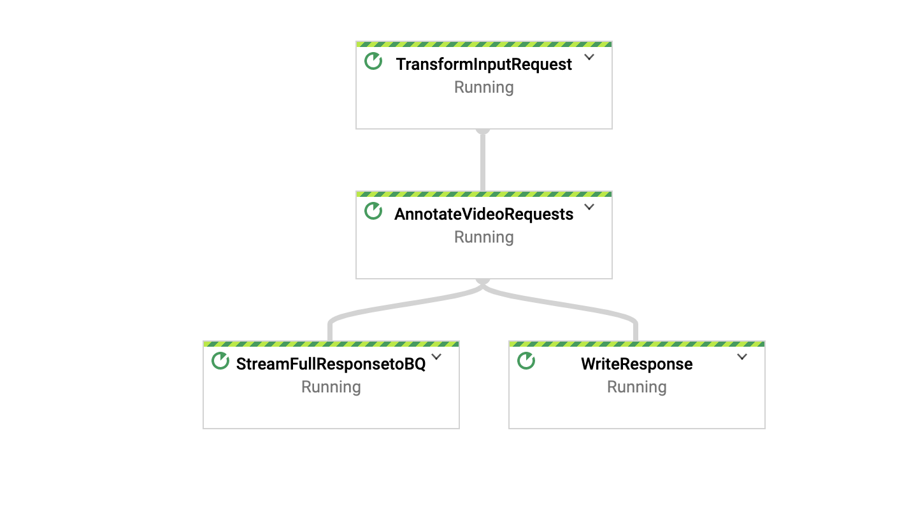

# Video Analytics Solution Using Dataflow & Video AI
This repo contains a reference implementations for a series of  video analytics solutions by using Dataflow & Video AI.  The goal is to provide an easy to use end to end solution to process large scale unstructured video data by bringing multiple data streams together to drive insight using Video AI. 

## Table of Contents  
* [Object Detection in Video Clips](#object-detection-in-video-clips).  
	* [Reference Architecture](#reference-architecture-using-video-intelligence-api).      
	* [Build & Run Using Dataflow Flex Template](#build-run).  
	* [Test Using a Drone  Video Clip Dataset from Kaggle ](#test). 
	* [Custom Json Output and Filtering ](#custom-json-output-and-filtering ). 
 

## Object Detection in Video Clips 
Many customers across various industries  are producing large volumes of unstructured  data and are looking for easy to use streaming solutions to  analyze in near real time. For example, alarm monitoring companies want to augment motion sensor data with the analysis of video clips (and, eventually, live video feeds) to determine if a dispatch of a security team to a customer’s premises is justified and therefore reduce the false positive rate that drives the costs of their operations up. This section of this repo highlights how you can use this pipeline to detect objects in large scale video clips and customize the Json response for downstream systems to consume.  

For testing purpose, we use this [dataset](https://www.kaggle.com/kmader/drone-videos) from Kaggle collected from drone video clips.

### Reference Architecture Using Video Intelligence API
 

### Build & Run
1. Create  two buckets , one to store input dataset and another one to store fle template config file

```export DRONE_VIDEO_CLIPS_BUCKET=${PROJECT_ID}_drone_dataset
export DF_TEMPLATE_BUCKET=${PROJECT_ID}_df_temp_config
gsutil mb -c standard -l <var>region</var> gs://${DRONE_VIDEO_CLIPS_BUCKET}
gsutil mb -c standard -l <var>region</var> gs://${DF_TEMPLATE_BUCKET}
```

2. Create required topics and subscriptions as below

```export INPUT_TOPIC_ID=<var>topic-id</var>
export INPUT_SUBSCRIPTION_ID=<var>subscription-id</var>
export OUTPUT_TOPIC_ID=<var>topic-id</var>
export OUTPUT_SUBSCRIPTION_ID=<var>subscription-id</var>
gcloud pubsub topics create $INPUT_TOPIC_ID
gcloud pubsub subscriptions create $INPUT_SUBSCRIPTION_ID --topic=$OUTPUT_TOPIC_ID
gcloud pubsub topics create $OUTPUT_TOPIC_ID
gcloud pubsub subscriptions create $OUTPUT_SUBSCRIPTION_ID --topic=$OUTPUT_TOPIC_ID
```

3. Create a BigQuery Dataset and Table. 

```export DATASET_NAME=<var>dataset-name</var>
bq --location=US mk -d \
--description "vide-object-tracking-dataset" \
${DATASET_NAME}
bq mk -t --schema src/main/resources/table_schema.json \
--description "object_tracking_data" \
${PROJECT_ID}:${DATASET_NAME}.object_tracking_analysis
```

4. Gradle Build

```gradle spotlessApply -DmainClass=com.google.solutions.df.video.analytics.VideoAnalyticsPipeline 
gradle build -DmainClass=com.google.solutions.df.video.analytics.VideoAnalyticsPipeline 
```  

5.  Trigger using Gradle Run 
This configuration is defaulted to 1

- 1 second processing time
- filter for window and person entity with confidence greater than 90%

```
gradle run -DmainClass=com.google.solutions.df.video.analytics.VideoAnalyticsPipeline \
-Pargs=" --topicId=projects/next-demo-2020/topics/video-analysis --runner=DirectRunner \
--project=${PROJECT_ID} --autoscalingAlgorithm=THROUGHPUT_BASED --workerMachineType=n1-highmem-4 \
--numWorkers=3 --maxNumWorkers=5 --region=us-central1 \
--subscriberId=projects/${PROJECT_ID}/subscriptions/${INPUT_SUBSCRIPTION_ID} \
--features=OBJECT_TRACKING --entity=window,person --windowInterval=1 \
--keyRange=8 --tableSpec=${PROJECT_ID}:${DATASET_NAME}.object_tracking_analysis \
--confidence=0.9 --topicId=projects/${PROJECT_ID}/topic/${OUTPUT_TOPIC_ID}" 
```

6. Create a docker image for flex template. 
 
```gradle jib --image=gcr.io/${PROJECT_ID}/df-video-analytics:latest -DmainClass=com.google.solutions.df.video.analytics.VideoAnalyticsPipeline
```

7. Update the template config file src/main/resources/dynamic_template_video_analytics.json with image name and upload it to a Cloud Storage bucket.

```nano dynamic_template_video_analytics.json
{"image": "gcr.io/<var>project-id</var>/df-video-analytics",
 "sdk_info": {"language": "JAVA"}
}
gsutil cp src/main/resources/dynamic_template_video_analytics.json gs://${DF_TEMPLATE_BUCKET}/
```


8. Trigger using Dataflow flex template

```gcloud beta dataflow flex-template run "video-object-tracking" \
--project=${PROJECT_ID} --region=us-central1 \ --template-file-gcs-location=gs://${DF_TEMPLATE_BUCKET}/dynamic_template_video_analytics.json \
--parameters=^~^autoscalingAlgorithm="NONE"~numWorkers=5~maxNumWorkers=5 \
~workerMachineType=n1-highmem-4 \
~subscriberId=projects/${PROJECT_ID}/subscriptions/${INPUT_SUBSCRIPTION_ID} \
~tableSpec=${PROJECT_ID}:${DATASET_NAME}.object_tracking_analysis \
~features=OBJECT_TRACKING~entity=window,person~windowInterval=1 \
~streaming=true~keyRange=8~confidence=0.9 \
~topicId=projects/${PROJECT_ID}/topics/${OUTPUT_TOPIC_ID} 
```

### Test
1.  Validate the pipeline is running from the Dataflow console
 
 
2. Copy test files to the bucket 
1. Enable GCS metadata notification for the PubSub and copy sample data to your bucket. 

```
gsutil notification create -t ${INPUT_TOPIC_ID} -f json gs://${DRONE_VIDEO_CLIPS_BUCKET}
gsutil -m cp gs://df-video-analytics-drone-dataset/* gs://${DRONE_VIDEO_CLIPS_BUCKET}
```

3. Please validate if pipeline has successfully processed the data by looking the elements count in the write transform. 

 
 
 
 
 
 
 

### Custom Json Output and Filtering 
Pipeline uses a nested table in BigQuery to store the API response and also publishes a customized json message to a PubSub topic so that downstream applications can consume it in near real time. This reference implementation shows how you can customize the standard Json response received from Video intelligence API by using [Row/Schema](master/src/main/java/com/google/solutions/df/video/analytics/common/Util.java#30) and built in Beam transform like [ToJson and Filter](master/src/main/java/com/google/solutions/df/video/analytics/common/ResponseWriteTransform.java#66) by column name. 

#### BigQuery Schema 

 . 

* You can use the following query to investigate different objects and confidence level found from our kaggle dataset collected from drone clips

```
SELECT  gcsUri, file_data.entity, max(file_data.confidence) as max_confidence 
FROM `<project_id>.<dataset_name>.object_tracking_analysis` 
WHERE gcsUri like '%<source_bucket_name>%'
GROUP by  gcsUri, file_data.entity
ORDER by max_confidence DESC
```
 . 

*  In our pipeline configuration, we used "entity=window, person" and "confidence=0.9" as pipeline arguments to filter out the response.  You can use this parameters to filter out any object in the clips that may be required to for near real time actions like notification. You can use the command below to pull message from thee output subscription. 


```
gcloud pubsub subscriptions pull ${OUTPUT_SUBSCRIPTION_ID} --auto-ack --limit 1 --project $PROJECT_ID 
```


* You should see json output like below:

```{
   "gcsUri":"/drone-video-dataset/gbikes_dinosaur.mp4",
   "file_data":{
      "entity":"person",
      "confidence":0.9411579370498657,
      "startTimeOffset":"28.833333",
      "endTimeOffset":"29.433333"
   },
   "frame_data":{
      "detections":[
         {
            "frame":1,
            "timeOffset":"28.833333",
            "x":0.044736248,
            "y":0.6212879,
            "w":0.101860054,
            "h":0.8296899
         },
         {
            "frame":2,
            "timeOffset":"28.933333",
            "x":0.024250263,
            "y":0.58061814,
            "w":0.08128166,
            "h":0.7889516
         },
         {
            "frame":3,
            "timeOffset":"29.033333",
            "x":0.02043231,
            "y":0.5591222,
            "w":0.077463575,
            "h":0.7674556
         },
         {
            "frame":4,
            "timeOffset":"29.133333",
            "x":0.029356558,
            "y":0.56631297,
            "w":0.08638781,
            "h":0.7746463
         },
         {
            "frame":5,
            "timeOffset":"29.233333000000002",
            "x":0.05688007,
            "y":0.59617907,
            "w":0.095578365,
            "h":0.76954556
         },
         {
            "frame":6,
            "timeOffset":"29.333333",
            "x":0.061868794,
            "y":0.61623406,
            "w":0.09874276,
            "h":0.78598607
         },
         {
            "frame":7,
            "timeOffset":"29.433333",
            "x":0.06440044,
            "y":0.64491415,
            "w":0.10113216,
            "h":0.8143843
         }
      ]
   }
}
```


