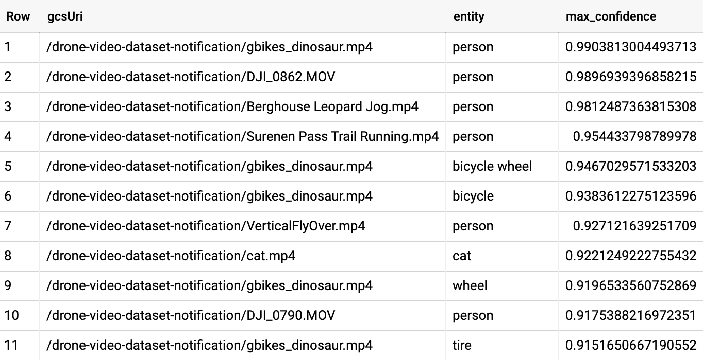

# Video Analytics Solution Using Dataflow & Video AI
This repo contains a reference implementations for video analytics solutions by using Dataflow & Video AI.  The goal is to provide an easy to use end to end solution to process large scale unstructured video data by bringing multiple data streams together to drive insight using Video AI. 

## Table of Contents  
* [Object Detection in Video Clips](#object-detection-in-video-clips).  
	* [Reference Architecture](#reference-architecture-using-video-intelligence-api).      
	* [Build & Run Using Dataflow Flex Template](#build-run).  
	* [Test Using a Drone  Video Clip Dataset from Kaggle ](#test). 
	* [Custom Json Output and Filtering ](#custom-json-output-and-filtering ). 

## Object Detection in Video Clips 
Many customers across various industries  are producing large volumes of unstructured  data and are looking for easy to use streaming solutions to  analyze in near real time. For example, alarm monitoring companies want to augment motion sensor data with the analysis of video clips (and, eventually, live video feeds) to determine if a dispatch of a security team to a customer’s premises is justified and therefore reduce the false positive rate that drives the costs of their operations up. This section of this repo highlights how you can use this pipeline to detect objects in large scale video clips and customize the Json response for downstream systems to consume.  

For testing purpose, we use this [dataset](https://www.kaggle.com/kmader/drone-videos) from Kaggle collected from drone video clips.

### Reference Architecture Using Video Intelligence API
 

### How the pipeline works?
1. Solution assumes video clips are uploaded and stored in a GCS bucket  and a metadata notification is sent out to a PubSub topic.

2. Dataflow pipeline process the video files in micro batch  and based on the list of features passed as pipeline argument.  

3. Dataflow pipeline uses the list of entities and confidence score to filter the Video Intelligence API response and output to following sinks:
	 *  In a nested table in BigQuery for further analysis. 
	 * In a PubSub topic by customizing the Json response so that downstream applications can consume in near real time. 

### Build & Run

1. Enable some Google Cloud APIs:

```
gcloud services enable dataflow.googleapis.com containerregistry.googleapis.com videointelligence.googleapis.com
```

2. Set some environment variables (replace values with your project ID and preferred region):

```
export PROJECT=[PROJECT]
export REGION=[REGION]
```

3. Create two buckets, one to store input video files and another one to store Dataflow Flex template config files:

```
export VIDEO_CLIPS_BUCKET=${PROJECT}_videos
export DATAFLOW_TEMPLATE_BUCKET=${PROJECT}_dataflow_template_config
gsutil mb -c standard -l ${REGION} gs://${VIDEO_CLIPS_BUCKET}
gsutil mb -c standard -l ${REGION} gs://${DATAFLOW_TEMPLATE_BUCKET}
```

4. Create required topics and subscriptions as below

```
export GCS_NOTIFICATION_TOPIC="gcs-notification-topic"
export GCS_NOTIFICATION_SUBSCRIPTION="gcs-notification-subscription"
export OBJECT_DETECTION_TOPIC="object-detection-topic"
export OBJECT_DETECTION_SUBSCRIPTION="object-detection-subscription"
gcloud pubsub topics create ${GCS_NOTIFICATION_TOPIC}
gcloud pubsub subscriptions create ${GCS_NOTIFICATION_SUBSCRIPTION} --topic=${GCS_NOTIFICATION_TOPIC}
gcloud pubsub topics create ${OBJECT_DETECTION_TOPIC}
gcloud pubsub subscriptions create ${OBJECT_DETECTION_SUBSCRIPTION} --topic=${OBJECT_DETECTION_TOPIC}
```

5. Create a BigQuery dataset and Table. 

```
export BIGQUERY_DATASET="video_analytics"
bq mk -d --location=US ${BIGQUERY_DATASET}

bq mk -t \
--schema src/main/resources/table_schema.json \
--description "object_tracking_data" \
${PROJECT}:${BIGQUERY_DATASET}.object_tracking_analysis
```

6. Gradle Build

```
gradle spotlessApply -DmainClass=com.google.solutions.df.video.analytics.VideoAnalyticsPipeline 
gradle build -DmainClass=com.google.solutions.df.video.analytics.VideoAnalyticsPipeline 
```  

7.  Trigger using Gradle Run 

This configuration is defaulted to 1 

- 1 second processing time
- filter for window and person entity with confidence greater than 90%

```
gradle run -DmainClass=com.google.solutions.df.video.analytics.VideoAnalyticsPipeline \
-Pargs=" --outputTopic=projects/${PROJECT}/topics/${OBJECT_DETECTION_TOPIC} --runner=DataflowRunner \
--project=${PROJECT} --autoscalingAlgorithm=THROUGHPUT_BASED --workerMachineType=n1-highmem-4 \
--numWorkers=3 --maxNumWorkers=5 --region=${REGION} \
--inputNotificationSubscription=projects/${PROJECT}/subscriptions/${GCS_NOTIFICATION_SUBSCRIPTION} \
--features=OBJECT_TRACKING --entities=window,person --windowInterval=1 \
--tableReference=${PROJECT}:${BIGQUERY_DATASET}.object_tracking_analysis \
--confidenceThreshold=0.9"
```

8. Create a docker image for flex template. 
 
```
gradle jib -Djib.to.image=gcr.io/${PROJECT}/dataflow-video-analytics:latest
```

9. Upload the template JSON config file to GCS.

```
cat << EOF | gsutil cp - gs://${DATAFLOW_TEMPLATE_BUCKET}/dynamic_template_video_analytics.json
{
  "image": "gcr.io/${PROJECT}/dataflow-video-analytics:latest",
  "sdk_info": {"language": "JAVA"}
}
EOF
```

10. Trigger using Dataflow flex template

```
gcloud beta dataflow flex-template run "video-object-tracking" \
--project=${PROJECT} \
--region=${REGION} \
--template-file-gcs-location=gs://${DATAFLOW_TEMPLATE_BUCKET}/dynamic_template_video_analytics.json \
--parameters=<<'EOF'
^~^autoscalingAlgorithm="NONE"~numWorkers=5~maxNumWorkers=5
~workerMachineType=n1-highmem-4
~inputNotificationSubscription=projects/${PROJECT}/subscriptions/${GCS_NOTIFICATION_SUBSCRIPTION}
~tableReference=${PROJECT}:${BIGQUERY_DATASET}.object_tracking_analysis
~features=OBJECT_TRACKING~entities=window,person~windowInterval=1
~streaming=true~confidenceThreshold=0.9
~outputTopic=projects/${PROJECT}/topics/${OBJECT_DETECTION_TOPIC}
EOF
```

### Test
1.  Validate the pipeline is running from the Dataflow console
 
 
2. Enable GCS metadata notification for the PubSub and copy sample data to your bucket. 

```
gsutil notification create -t ${GCS_NOTIFICATION_TOPIC} -f json gs://${VIDEO_CLIPS_BUCKET}
```

3. Copy test files to the bucket:

```
gsutil -m cp "gs://df-video-analytics-drone-dataset/*" gs://${VIDEO_CLIPS_BUCKET}
```

4. Please validate if pipeline has successfully processed the data by looking the elements count in the write transform. 

 
 
 
 
 
 
 

### Custom Json Output and Filtering 
Pipeline uses a nested table in BigQuery to store the API response and also publishes a customized json message to a PubSub topic so that downstream applications can consume it in near real time. This reference implementation shows how you can customize the standard Json response received from Video intelligence API by using [Row/Schema](https://github.com/GoogleCloudPlatform/dataflow-video-analytics/blob/master/src/main/java/com/google/solutions/df/video/analytics/common/Util.java) and built in Beam transform like [ToJson and Filter](https://github.com/GoogleCloudPlatform/dataflow-video-analytics/blob/master/src/main/java/com/google/solutions/df/video/analytics/common/ResponseWriteTransform.java) by column name. 

#### BigQuery Schema 

 . 

* You can use the following query to investigate different objects and confidence level found from our kaggle dataset collected from the video clips

```
SELECT  gcsUri, file_data.entity, max(file_data.confidence) as max_confidence 
FROM `video_analytics.object_tracking_analysis` 
WHERE gcsUri like '%_video_dataset%'
GROUP by  gcsUri, file_data.entity
ORDER by max_confidence DESC
```
 . 

*  In the test pipeline, you can see from this argument  "entities=window,person" and "confidenceThreshold=0.9" , pipeline is filtering the response that may be required  for near real time processing for downstream applications.  You can use the command below to see the publish message from the output subscription. 

```
gcloud pubsub subscriptions pull ${OBJECT_DETECTION_SUBSCRIPTION} --auto-ack --limit 1 --project ${PROJECT}
```


* You should see json output like below:

```{
   "gcsUri":"gs://drone-video-dataset/cat.mp4",
   "entity":"cat",
   "frame_data":[
      {
         "processing_timestamp":"2020-06-25 13:50:14.964000",
         "timeOffset":"0.0",
         "confidence":0.8674923181533813,
         "left":0.14,
         "top":0.22545259,
         "right":0.74,
         "bottom":0.86
      },
      {
         "processing_timestamp":"2020-06-25 13:50:15.270000",
         "timeOffset":"0.12",
         "confidence":0.8674923181533813,
         "left":0.140104,
         "top":0.22684973,
         "right":0.740104,
         "bottom":0.8611095
      },
      {
         "processing_timestamp":"2020-06-25 13:50:15.273000",
         "timeOffset":"0.24",
         "confidence":0.8674923181533813,
         "left":0.14010431,
         "top":0.22685367,
         "right":0.7401043,
         "bottom":0.861113
      },
      {
         "processing_timestamp":"2020-06-25 13:50:15.275000",
         "timeOffset":"0.36",
         "confidence":0.8674923181533813,
         "left":0.14010426,
         "top":0.22762112,
         "right":0.7401043,
         "bottom":0.8618804
      },
      {
         "processing_timestamp":"2020-06-25 13:50:15.276000",
         "timeOffset":"0.48",
         "confidence":0.8603168725967407,
         "left":0.14002976,
         "top":0.23130082,
         "right":0.7400298,
         "bottom":0.86003596
      },
      {
         "processing_timestamp":"2020-06-25 13:50:15.278000",
         "timeOffset":"0.6",
         "confidence":0.855533242225647,
         "left":0.1400657,
         "top":0.23179094,
         "right":0.7400657,
         "bottom":0.85963726
      },
      {
         "processing_timestamp":"2020-06-25 13:50:15.280000",
         "timeOffset":"0.72",
         "confidence":0.8521164059638977,
         "left":0.14040793,
         "top":0.2317678,
         "right":0.74040794,
         "bottom":0.8595505
      },
      {
         "processing_timestamp":"2020-06-25 13:50:15.282000",
         "timeOffset":"0.84",
         "confidence":0.8495537042617798,
         "left":0.13996935,
         "top":0.23112111,
         "right":0.7399694,
         "bottom":0.85889924
      },
      {
         "processing_timestamp":"2020-06-25 13:50:15.284000",
         "timeOffset":"0.96",
         "confidence":0.8448781967163086,
         "left":0.13994369,
         "top":0.23411563,
         "right":0.73994374,
         "bottom":0.85897374
      },
      {
         "processing_timestamp":"2020-06-25 13:50:15.286000",
         "timeOffset":"1.08",
         "confidence":0.8411377668380737,
         "left":0.13969812,
         "top":0.23456246,
         "right":0.7396982,
         "bottom":0.85869277
      },
      {
         "processing_timestamp":"2020-06-25 13:50:15.288000",
         "timeOffset":"1.2",
         "confidence":0.8380774259567261,
         "left":0.13988204,
         "top":0.23564537,
         "right":0.73988205,
         "bottom":0.8597235
      },
      {
         "processing_timestamp":"2020-06-25 13:50:15.290000",
         "timeOffset":"1.32",
         "confidence":0.8355271816253662,
         "left":0.13939038,
         "top":0.2356385,
         "right":0.7393904,
         "bottom":0.8597129
      },
      {
         "processing_timestamp":"2020-06-25 13:50:15.291000",
         "timeOffset":"1.44",
         "confidence":0.8365711569786072,
         "left":0.1396677,
         "top":0.237892,
         "right":0.7396677,
         "bottom":0.8596157
      },
      {
         "processing_timestamp":"2020-06-25 13:50:15.293000",
         "timeOffset":"1.56",
         "confidence":0.8374660611152649,
         "left":0.13992976,
         "top":0.23938878,
         "right":0.7399298,
         "bottom":0.8607157
      },
      {
         "processing_timestamp":"2020-06-25 13:50:15.295000",
         "timeOffset":"1.6800000000000002",
         "confidence":0.8382416367530823,
         "left":0.14008056,
         "top":0.23947656,
         "right":0.7400806,
         "bottom":0.86077505
      },
      {
         "processing_timestamp":"2020-06-25 13:50:15.296000",
         "timeOffset":"1.8",
         "confidence":0.8389202356338501,
         "left":0.1401473,
         "top":0.23935243,
         "right":0.74014735,
         "bottom":0.8606489
      },
      {
         "processing_timestamp":"2020-06-25 13:50:15.298000",
         "timeOffset":"1.92",
         "confidence":0.8386650681495667,
         "left":0.14010043,
         "top":0.24023329,
         "right":0.74010044,
         "bottom":0.86011416
      },
      {
         "processing_timestamp":"2020-06-25 13:50:15.300000",
         "timeOffset":"2.04",
         "confidence":0.8384382128715515,
         "left":0.13980526,
         "top":0.24069837,
         "right":0.7398053,
         "bottom":0.86017406
      },
      {
         "processing_timestamp":"2020-06-25 13:50:15.301000",
         "timeOffset":"2.16",
         "confidence":0.8382352590560913,
         "left":0.13931659,
         "top":0.24082524,
         "right":0.7393166,
         "bottom":0.86027193
      },
      {
         "processing_timestamp":"2020-06-25 13:50:15.303000",
         "timeOffset":"2.2800000000000002",
         "confidence":0.8380526304244995,
         "left":0.13843018,
         "top":0.2402948,
         "right":0.7384302,
         "bottom":0.8597394
      },
      {
         "processing_timestamp":"2020-06-25 13:50:15.407000",
         "timeOffset":"2.4",
         "confidence":0.8352444767951965,
         "left":0.13915038,
         "top":0.23895234,
         "right":0.7391504,
         "bottom":0.86015505
      },
      {
         "processing_timestamp":"2020-06-25 13:50:15.417000",
         "timeOffset":"2.52",
         "confidence":0.8326915502548218,
         "left":0.13972455,
         "top":0.23933966,
         "right":0.7397246,
         "bottom":0.8606292
      },
      {
         "processing_timestamp":"2020-06-25 13:50:15.429000",
         "timeOffset":"2.64",
         "confidence":0.8303606510162354,
         "left":0.1397447,
         "top":0.23908304,
         "right":0.7397447,
         "bottom":0.86037886
      },
      {
         "processing_timestamp":"2020-06-25 13:50:15.438000",
         "timeOffset":"2.76",
         "confidence":0.8282240033149719,
         "left":0.14002168,
         "top":0.23948346,
         "right":0.7400217,
         "bottom":0.8607797
      },
      {
         "processing_timestamp":"2020-06-25 13:50:15.738000",
         "timeOffset":"2.88",
         "confidence":0.8262085914611816,
         "left":0.14009245,
         "top":0.22150257,
         "right":0.74009246,
         "bottom":0.8641622
      },
      {
         "processing_timestamp":"2020-06-25 13:50:15.750000",
         "timeOffset":"3.0",
         "confidence":0.8243482112884521,
         "left":0.14016113,
         "top":0.21722586,
         "right":0.7401612,
         "bottom":0.86068213
      },
      {
         "processing_timestamp":"2020-06-25 13:50:15.763000",
         "timeOffset":"3.12",
         "confidence":0.8226256370544434,
         "left":0.14017326,
         "top":0.21601935,
         "right":0.7401733,
         "bottom":0.85953337
      },
      {
         "processing_timestamp":"2020-06-25 13:50:15.775000",
         "timeOffset":"3.24",
         "confidence":0.8210261464118958,
         "left":0.1401596,
         "top":0.21596469,
         "right":0.74015963,
         "bottom":0.8594829
      },
      {
         "processing_timestamp":"2020-06-25 13:50:16.024000",
         "timeOffset":"3.36",
         "confidence":0.820344865322113,
         "left":0.14007719,
         "top":0.21805382,
         "right":0.7400772,
         "bottom":0.85872144
      },
      {
         "processing_timestamp":"2020-06-25 13:50:16.037000",
         "timeOffset":"3.48",
         "confidence":0.819709062576294,
         "left":0.14039858,
         "top":0.21938811,
         "right":0.7403986,
         "bottom":0.8592641
      },
      {
         "processing_timestamp":"2020-06-25 13:50:16.055000",
         "timeOffset":"3.6",
         "confidence":0.8191142678260803,
         "left":0.14089894,
         "top":0.22170709,
         "right":0.74089897,
         "bottom":0.8615263
      },
      {
         "processing_timestamp":"2020-06-25 13:50:16.068000",
         "timeOffset":"3.7199999999999998",
         "confidence":0.8185566663742065,
         "left":0.13991766,
         "top":0.22300643,
         "right":0.7399177,
         "bottom":0.8628215
      },
      {
         "processing_timestamp":"2020-06-25 13:50:16.332000",
         "timeOffset":"3.84",
         "confidence":0.8195717930793762,
         "left":0.13985933,
         "top":0.23043707,
         "right":0.73985934,
         "bottom":0.8597388
      },
      {
         "processing_timestamp":"2020-06-25 13:50:16.345000",
         "timeOffset":"3.96",
         "confidence":0.820527195930481,
         "left":0.13962287,
         "top":0.23139077,
         "right":0.7396229,
         "bottom":0.8592774
      },
      {
         "processing_timestamp":"2020-06-25 13:50:16.358000",
         "timeOffset":"4.08",
         "confidence":0.8214280009269714,
         "left":0.13920514,
         "top":0.23131049,
         "right":0.7392052,
         "bottom":0.85909605
      },
      {
         "processing_timestamp":"2020-06-25 13:50:16.371000",
         "timeOffset":"4.2",
         "confidence":0.8222787380218506,
         "left":0.13868846,
         "top":0.23050903,
         "right":0.73868847,
         "bottom":0.85828733
      },
      {
         "processing_timestamp":"2020-06-25 13:50:16.627000",
         "timeOffset":"4.32",
         "confidence":0.8225590586662292,
         "left":0.1393156,
         "top":0.23085938,
         "right":0.7393156,
         "bottom":0.85942495
      },
      {
         "processing_timestamp":"2020-06-25 13:50:16.641000",
         "timeOffset":"4.44",
         "confidence":0.8228245973587036,
         "left":0.14012083,
         "top":0.23147784,
         "right":0.7401209,
         "bottom":0.8593122
      },
      {
         "processing_timestamp":"2020-06-25 13:50:16.653000",
         "timeOffset":"4.5600000000000005",
         "confidence":0.8230764865875244,
         "left":0.14057763,
         "top":0.2310447,
         "right":0.74057764,
         "bottom":0.8588265
      },
      {
         "processing_timestamp":"2020-06-25 13:50:16.667000",
         "timeOffset":"4.68",
         "confidence":0.8233157992362976,
         "left":0.14015028,
         "top":0.23128687,
         "right":0.74015033,
         "bottom":0.85906494
      },
      {
         "processing_timestamp":"2020-06-25 13:50:16.911000",
         "timeOffset":"4.8",
         "confidence":0.8235958218574524,
         "left":0.14007854,
         "top":0.23399295,
         "right":0.74007857,
         "bottom":0.85919845
      },
      {
         "processing_timestamp":"2020-06-25 13:50:16.923000",
         "timeOffset":"4.92",
         "confidence":0.8238624930381775,
         "left":0.1400914,
         "top":0.2350098,
         "right":0.74009144,
         "bottom":0.8600245
      },
      {
         "processing_timestamp":"2020-06-25 13:50:16.936000",
         "timeOffset":"5.04",
         "confidence":0.8241167664527893,
         "left":0.14041184,
         "top":0.23598476,
         "right":0.7404119,
         "bottom":0.8609858
      },
      {
         "processing_timestamp":"2020-06-25 13:50:16.948000",
         "timeOffset":"5.16",
         "confidence":0.8243594765663147,
         "left":0.14090824,
         "top":0.23696119,
         "right":0.74090827,
         "bottom":0.86196125
      },
      {
         "processing_timestamp":"2020-06-25 13:50:17.210000",
         "timeOffset":"5.28",
         "confidence":0.8246423602104187,
         "left":0.14048468,
         "top":0.23624915,
         "right":0.7404847,
         "bottom":0.86113405
      },
      {
         "processing_timestamp":"2020-06-25 13:50:17.223000",
         "timeOffset":"5.4",
         "confidence":0.824912965297699,
         "left":0.14024909,
         "top":0.23636924,
         "right":0.7402491,
         "bottom":0.8605016
      },
      {
         "processing_timestamp":"2020-06-25 13:50:17.236000",
         "timeOffset":"5.52",
         "confidence":0.8251720666885376,
         "left":0.14011624,
         "top":0.23621748,
         "right":0.74011624,
         "bottom":0.8602958
      },
      {
         "processing_timestamp":"2020-06-25 13:50:17.249000",
         "timeOffset":"5.64",
         "confidence":0.8254203200340271,
         "left":0.13974805,
         "top":0.23667319,
         "right":0.73974806,
         "bottom":0.8607476
      },
      {
         "processing_timestamp":"2020-06-25 13:50:17.521000",
         "timeOffset":"5.76",
         "confidence":0.8251921534538269,
         "left":0.13980603,
         "top":0.23456527,
         "right":0.73980606,
         "bottom":0.86073285
      },
      {
         "processing_timestamp":"2020-06-25 13:50:17.533000",
         "timeOffset":"5.88",
         "confidence":0.8249731063842773,
         "left":0.13994206,
         "top":0.2337158,
         "right":0.7399421,
         "bottom":0.8596591
      },
      {
         "processing_timestamp":"2020-06-25 13:50:17.544000",
         "timeOffset":"6.0",
         "confidence":0.8247626423835754,
         "left":0.1400398,
         "top":0.23378699,
         "right":0.7400398,
         "bottom":0.85971415
      },
      {
         "processing_timestamp":"2020-06-25 13:50:17.555000",
         "timeOffset":"6.12",
         "confidence":0.824560284614563,
         "left":0.14009605,
         "top":0.23393734,
         "right":0.7400961,
         "bottom":0.85986334
      },
      {
         "processing_timestamp":"2020-06-25 13:50:17.801000",
         "timeOffset":"6.24",
         "confidence":0.8251705169677734,
         "left":0.14005849,
         "top":0.23583958,
         "right":0.74005854,
         "bottom":0.8594936
      },
      {
         "processing_timestamp":"2020-06-25 13:50:17.811000",
         "timeOffset":"6.36",
         "confidence":0.825758159160614,
         "left":0.14009035,
         "top":0.2361941,
         "right":0.74009037,
         "bottom":0.8593786
      },
      {
         "processing_timestamp":"2020-06-25 13:50:17.823000",
         "timeOffset":"6.48",
         "confidence":0.8263244032859802,
         "left":0.13979475,
         "top":0.23512305,
         "right":0.7397948,
         "bottom":0.8582738
      },
      {
         "processing_timestamp":"2020-06-25 13:50:17.834000",
         "timeOffset":"6.6",
         "confidence":0.8268705010414124,
         "left":0.13868538,
         "top":0.23446016,
         "right":0.73868537,
         "bottom":0.8576085
      },
      {
         "processing_timestamp":"2020-06-25 13:50:18.054000",
         "timeOffset":"6.72",
         "confidence":0.8268845081329346,
         "left":0.13057992,
         "top":0.28184214,
         "right":0.58039474,
         "bottom":0.9312967
      },
      {
         "processing_timestamp":"2020-06-25 13:50:18.065000",
         "timeOffset":"6.84",
         "confidence":0.8268980979919434,
         "left":0.08853961,
         "top":0.31658807,
         "right":0.52741665,
         "bottom":0.9674072
      },
      {
         "processing_timestamp":"2020-06-25 13:50:18.075000",
         "timeOffset":"6.96",
         "confidence":0.826911211013794,
         "left":0.06704294,
         "top":0.3334238,
         "right":0.5051252,
         "bottom":0.98434204
      },
      {
         "processing_timestamp":"2020-06-25 13:50:18.087000",
         "timeOffset":"7.08",
         "confidence":0.8269238471984863,
         "left":0.06190448,
         "top":0.33772495,
         "right":0.49992973,
         "bottom":0.9886503
      },
      {
         "processing_timestamp":"2020-06-25 13:50:18.354000",
         "timeOffset":"7.2",
         "confidence":0.8280026912689209,
         "left":0.06489356,
         "top":0.33439517,
         "right":0.5030792,
         "bottom":0.98579216
      },
      {
         "processing_timestamp":"2020-06-25 13:50:18.363000",
         "timeOffset":"7.32",
         "confidence":0.8290467262268066,
         "left":0.069956094,
         "top":0.3307092,
         "right":0.50798875,
         "bottom":0.98166895
      },
      {
         "processing_timestamp":"2020-06-25 13:50:18.374000",
         "timeOffset":"7.44",
         "confidence":0.830057680606842,
         "left":0.07436513,
         "top":0.32770437,
         "right":0.5123868,
         "bottom":0.97863275
      },
      {
         "processing_timestamp":"2020-06-25 13:50:18.385000",
         "timeOffset":"7.5600000000000005",
         "confidence":0.8310369849205017,
         "left":0.07753691,
         "top":0.32608902,
         "right":0.51555777,
         "bottom":0.97701514
      },
      {
         "processing_timestamp":"2020-06-25 13:50:18.633000",
         "timeOffset":"7.68",
         "confidence":0.8300080895423889,
         "left":0.08665312,
         "top":0.3235474,
         "right":0.5168375,
         "bottom":0.9727422
      },
      {
         "processing_timestamp":"2020-06-25 13:50:18.642000",
         "timeOffset":"7.8",
         "confidence":0.8290103673934937,
         "left":0.08949114,
         "top":0.32216492,
         "right":0.5187308,
         "bottom":0.9703882
      },
      {
         "processing_timestamp":"2020-06-25 13:50:18.652000",
         "timeOffset":"7.92",
         "confidence":0.8280424475669861,
         "left":0.090038225,
         "top":0.32201126,
         "right":0.51921016,
         "bottom":0.9701648
      },
      {
         "processing_timestamp":"2020-06-25 13:50:18.663000",
         "timeOffset":"8.04",
         "confidence":0.8271030187606812,
         "left":0.08985308,
         "top":0.32223588,
         "right":0.51902014,
         "bottom":0.97038436
      },
      {
         "processing_timestamp":"2020-06-25 13:50:18.924000",
         "timeOffset":"8.16",
         "confidence":0.8268907070159912,
         "left":0.09164012,
         "top":0.32142347,
         "right":0.5191343,
         "bottom":0.9714647
      },
      {
         "processing_timestamp":"2020-06-25 13:50:18.934000",
         "timeOffset":"8.28",
         "confidence":0.8266844749450684,
         "left":0.09209744,
         "top":0.3223618,
         "right":0.51921034,
         "bottom":0.9723648
      },
      {
         "processing_timestamp":"2020-06-25 13:50:18.942000",
         "timeOffset":"8.4",
         "confidence":0.8264840841293335,
         "left":0.09178898,
         "top":0.32294077,
         "right":0.5188744,
         "bottom":0.972941
      },
      {
         "processing_timestamp":"2020-06-25 13:50:18.952000",
         "timeOffset":"8.52",
         "confidence":0.826289176940918,
         "left":0.09117902,
         "top":0.32322773,
         "right":0.5182625,
         "bottom":0.97322774
      },
      {
         "processing_timestamp":"2020-06-25 13:50:19.202000",
         "timeOffset":"8.64",
         "confidence":0.8263067603111267,
         "left":0.09129507,
         "top":0.32287508,
         "right":0.5187728,
         "bottom":0.9708604
      },
      {
         "processing_timestamp":"2020-06-25 13:50:19.213000",
         "timeOffset":"8.76",
         "confidence":0.8263238668441772,
         "left":0.091604404,
         "top":0.3230035,
         "right":0.51871604,
         "bottom":0.9702804
      },
      {
         "processing_timestamp":"2020-06-25 13:50:19.222000",
         "timeOffset":"8.88",
         "confidence":0.8263404965400696,
         "left":0.09168081,
         "top":0.32296923,
         "right":0.51876616,
         "bottom":0.9701954
      },
      {
         "processing_timestamp":"2020-06-25 13:50:19.233000",
         "timeOffset":"9.0",
         "confidence":0.8263567090034485,
         "left":0.09170318,
         "top":0.32299358,
         "right":0.51878667,
         "bottom":0.9702161
      },
      {
         "processing_timestamp":"2020-06-25 13:50:19.482000",
         "timeOffset":"9.12",
         "confidence":0.8269582986831665,
         "left":0.089609906,
         "top":0.32152852,
         "right":0.5194917,
         "bottom":0.97274303
      },
      {
         "processing_timestamp":"2020-06-25 13:50:19.492000",
         "timeOffset":"9.24",
         "confidence":0.8275445103645325,
         "left":0.08920442,
         "top":0.32261112,
         "right":0.5189059,
         "bottom":0.97355783
      },
      {
         "processing_timestamp":"2020-06-25 13:50:19.501000",
         "timeOffset":"9.36",
         "confidence":0.8281158804893494,
         "left":0.088971704,
         "top":0.3231431,
         "right":0.5186602,
         "bottom":0.97407055
      },
      {
         "processing_timestamp":"2020-06-25 13:50:19.512000",
         "timeOffset":"9.48",
         "confidence":0.8286729454994202,
         "left":0.08921128,
         "top":0.32280126,
         "right":0.51889884,
         "bottom":0.97372735
      },
      {
         "processing_timestamp":"2020-06-25 13:50:19.739000",
         "timeOffset":"9.6",
         "confidence":0.8293570876121521,
         "left":0.10104167,
         "top":0.32146558,
         "right":0.5164512,
         "bottom":0.9768567
      },
      {
         "processing_timestamp":"2020-06-25 13:50:19.748000",
         "timeOffset":"9.72",
         "confidence":0.8300245404243469,
         "left":0.10425598,
         "top":0.3215292,
         "right":0.5184154,
         "bottom":0.97707295
      },
      {
         "processing_timestamp":"2020-06-25 13:50:19.759000",
         "timeOffset":"9.84",
         "confidence":0.8306758999824524,
         "left":0.10575732,
         "top":0.32151958,
         "right":0.51982677,
         "bottom":0.97707427
      },
      {
         "processing_timestamp":"2020-06-25 13:50:19.770000",
         "timeOffset":"9.96",
         "confidence":0.8313117623329163,
         "left":0.1062002,
         "top":0.32145858,
         "right":0.5202632,
         "bottom":0.97701406
      },
      {
         "processing_timestamp":"2020-06-25 13:50:20.008000",
         "timeOffset":"10.08",
         "confidence":0.8319015502929688,
         "left":0.10130604,
         "top":0.32305875,
         "right":0.5210935,
         "bottom":0.9709401
      },
      {
         "processing_timestamp":"2020-06-25 13:50:20.018000",
         "timeOffset":"10.2",
         "confidence":0.8324776291847229,
         "left":0.10012769,
         "top":0.32228667,
         "right":0.51991904,
         "bottom":0.96955603
      },
      {
         "processing_timestamp":"2020-06-25 13:50:20.028000",
         "timeOffset":"10.32",
         "confidence":0.8330404758453369,
         "left":0.099489644,
         "top":0.32241064,
         "right":0.51928127,
         "bottom":0.96963626
      },
      {
         "processing_timestamp":"2020-06-25 13:50:20.038000",
         "timeOffset":"10.44",
         "confidence":0.833590567111969,
         "left":0.099231035,
         "top":0.3226457,
         "right":0.5190227,
         "bottom":0.9698682
      },
      {
         "processing_timestamp":"2020-06-25 13:50:20.258000",
         "timeOffset":"10.56",
         "confidence":0.833891749382019,
         "left":0.103343815,
         "top":0.32157215,
         "right":0.51796246,
         "bottom":0.9715749
      },
      {
         "processing_timestamp":"2020-06-25 13:50:20.267000",
         "timeOffset":"10.68",
         "confidence":0.834186315536499,
         "left":0.10471395,
         "top":0.3219744,
         "right":0.5188164,
         "bottom":0.97197455
      },
      {
         "processing_timestamp":"2020-06-25 13:50:20.276000",
         "timeOffset":"10.8",
         "confidence":0.8344743251800537,
         "left":0.10592845,
         "top":0.32275498,
         "right":0.5199938,
         "bottom":0.97275496
      },
      {
         "processing_timestamp":"2020-06-25 13:50:20.287000",
         "timeOffset":"10.92",
         "confidence":0.8347561359405518,
         "left":0.10680653,
         "top":0.32317254,
         "right":0.52086926,
         "bottom":0.97317255
      },
      {
         "processing_timestamp":"2020-06-25 13:50:20.516000",
         "timeOffset":"11.04",
         "confidence":0.8354199528694153,
         "left":0.0894713,
         "top":0.3218272,
         "right":0.51593703,
         "bottom":0.97577274
      },
      {
         "processing_timestamp":"2020-06-25 13:50:20.526000",
         "timeOffset":"11.16",
         "confidence":0.836069643497467,
         "left":0.082695484,
         "top":0.32231364,
         "right":0.5097344,
         "bottom":0.97603476
      },
      {
         "processing_timestamp":"2020-06-25 13:50:20.537000",
         "timeOffset":"11.28",
         "confidence":0.8367056846618652,
         "left":0.07999435,
         "top":0.32299888,
         "right":0.5070745,
         "bottom":0.9767038
      },
      {
         "processing_timestamp":"2020-06-25 13:50:20.548000",
         "timeOffset":"11.4",
         "confidence":0.8373284339904785,
         "left":0.07907333,
         "top":0.3238646,
         "right":0.50615644,
         "bottom":0.9775684
      },
      {
         "processing_timestamp":"2020-06-25 13:50:20.774000",
         "timeOffset":"11.52",
         "confidence":0.8371695876121521,
         "left":0.08151252,
         "top":0.3222482,
         "right":0.51370883,
         "bottom":0.97966623
      },
      {
         "processing_timestamp":"2020-06-25 13:50:20.783000",
         "timeOffset":"11.64",
         "confidence":0.8370140194892883,
         "left":0.08471318,
         "top":0.32243386,
         "right":0.516998,
         "bottom":0.97984207
      },
      {
         "processing_timestamp":"2020-06-25 13:50:20.794000",
         "timeOffset":"11.76",
         "confidence":0.8368615508079529,
         "left":0.08679326,
         "top":0.32189742,
         "right":0.5190844,
         "bottom":0.9793049
      },
      {
         "processing_timestamp":"2020-06-25 13:50:20.805000",
         "timeOffset":"11.88",
         "confidence":0.836712121963501,
         "left":0.087679915,
         "top":0.32207635,
         "right":0.51997155,
         "bottom":0.9794837
      },
      {
         "processing_timestamp":"2020-06-25 13:50:21.056000",
         "timeOffset":"12.0",
         "confidence":0.835801899433136,
         "left":0.09187715,
         "top":0.26528853,
         "right":0.6798363,
         "bottom":0.9048803
      },
      {
         "processing_timestamp":"2020-06-25 13:50:21.069000",
         "timeOffset":"12.12",
         "confidence":0.8349095582962036,
         "left":0.13350219,
         "top":0.22684424,
         "right":0.7326444,
         "bottom":0.86492324
      },
      {
         "processing_timestamp":"2020-06-25 13:50:21.081000",
         "timeOffset":"12.24",
         "confidence":0.8340345025062561,
         "left":0.15348287,
         "top":0.21081206,
         "right":0.7534213,
         "bottom":0.8487834
      },
      {
         "processing_timestamp":"2020-06-25 13:50:21.091000",
         "timeOffset":"12.36",
         "confidence":0.83317631483078,
         "left":0.15832497,
         "top":0.20733678,
         "right":0.75832057,
         "bottom":0.8453003
      },
      {
         "processing_timestamp":"2020-06-25 13:50:21.303000",
         "timeOffset":"12.48",
         "confidence":0.8330645561218262,
         "left":0.15543677,
         "top":0.21314059,
         "right":0.7554365,
         "bottom":0.8469624
      },
      {
         "processing_timestamp":"2020-06-25 13:50:21.315000",
         "timeOffset":"12.6",
         "confidence":0.8329549431800842,
         "left":0.15019603,
         "top":0.21801017,
         "right":0.75019604,
         "bottom":0.8513785
      },
      {
         "processing_timestamp":"2020-06-25 13:50:21.327000",
         "timeOffset":"12.72",
         "confidence":0.8328473567962646,
         "left":0.14577799,
         "top":0.22194532,
         "right":0.745778,
         "bottom":0.8552811
      },
      {
         "processing_timestamp":"2020-06-25 13:50:21.337000",
         "timeOffset":"12.84",
         "confidence":0.8327417373657227,
         "left":0.1426533,
         "top":0.22511736,
         "right":0.7426533,
         "bottom":0.8584509
      },
      {
         "processing_timestamp":"2020-06-25 13:50:21.549000",
         "timeOffset":"12.96",
         "confidence":0.8324977159500122,
         "left":0.14049068,
         "top":0.23055576,
         "right":0.7404907,
         "bottom":0.85924464
      },
      {
         "processing_timestamp":"2020-06-25 13:50:21.562000",
         "timeOffset":"13.08",
         "confidence":0.8322581648826599,
         "left":0.13924648,
         "top":0.2305198,
         "right":0.7392465,
         "bottom":0.8583628
      },
      {
         "processing_timestamp":"2020-06-25 13:50:21.574000",
         "timeOffset":"13.2",
         "confidence":0.8320229649543762,
         "left":0.139774,
         "top":0.22988386,
         "right":0.739774,
         "bottom":0.8576663
      },
      {
         "processing_timestamp":"2020-06-25 13:50:21.586000",
         "timeOffset":"13.32",
         "confidence":0.831791877746582,
         "left":0.14003319,
         "top":0.23152667,
         "right":0.7400332,
         "bottom":0.8593048
      },
      {
         "processing_timestamp":"2020-06-25 13:50:21.792000",
         "timeOffset":"13.44",
         "confidence":0.8318328857421875,
         "left":0.13991892,
         "top":0.23935372,
         "right":0.73991895,
         "bottom":0.85856193
      },
      {
         "processing_timestamp":"2020-06-25 13:50:21.802000",
         "timeOffset":"13.56",
         "confidence":0.8318731188774109,
         "left":0.14027439,
         "top":0.24112068,
         "right":0.7402744,
         "bottom":0.8596886
      },
      {
         "processing_timestamp":"2020-06-25 13:50:21.812000",
         "timeOffset":"13.68",
         "confidence":0.8319126963615417,
         "left":0.14144516,
         "top":0.24161713,
         "right":0.7414452,
         "bottom":0.8601392
      },
      {
         "processing_timestamp":"2020-06-25 13:50:21.824000",
         "timeOffset":"13.8",
         "confidence":0.8319515585899353,
         "left":0.14304462,
         "top":0.2426885,
         "right":0.7430446,
         "bottom":0.86120725
      },
      {
         "processing_timestamp":"2020-06-25 13:50:22.060000",
         "timeOffset":"13.92",
         "confidence":0.8320046067237854,
         "left":0.043821935,
         "top":0.2754727,
         "right":0.7227192,
         "bottom":0.95569956
      },
      {
         "processing_timestamp":"2020-06-25 13:50:22.073000",
         "timeOffset":"14.04",
         "confidence":0.8320567607879639,
         "left":0.0072755706,
         "top":0.308753,
         "right":0.69173,
         "bottom":0.99271554
      },
      {
         "processing_timestamp":"2020-06-25 13:50:22.084000",
         "timeOffset":"14.16",
         "confidence":0.8321080207824707,
         "left":-0.00872397,
         "top":0.325456,
         "right":0.6761401,
         "bottom":1.0096939
      },
      {
         "processing_timestamp":"2020-06-25 13:50:22.096000",
         "timeOffset":"14.28",
         "confidence":0.8321584463119507,
         "left":-0.012141008,
         "top":0.32989505,
         "right":0.67275256,
         "bottom":1.0141528
      },
      {
         "processing_timestamp":"2020-06-25 13:50:22.269000",
         "timeOffset":"14.4",
         "confidence":0.8319032192230225,
         "left":0.08676756,
         "top":0.293838,
         "right":0.6928627,
         "bottom":0.9179541
      },
      {
         "processing_timestamp":"2020-06-25 13:50:22.279000",
         "timeOffset":"14.52",
         "confidence":0.8316521048545837,
         "left":0.12872776,
         "top":0.25315365,
         "right":0.7291535,
         "bottom":0.87292445
      },
      {
         "processing_timestamp":"2020-06-25 13:50:22.290000",
         "timeOffset":"14.64",
         "confidence":0.8314051032066345,
         "left":0.14628905,
         "top":0.2345523,
         "right":0.7463196,
         "bottom":0.8540201
      },
      {
         "processing_timestamp":"2020-06-25 13:50:22.301000",
         "timeOffset":"14.76",
         "confidence":0.8311620950698853,
         "left":0.15194583,
         "top":0.22891045,
         "right":0.75194806,
         "bottom":0.84835654
      }
   ]
}
```


